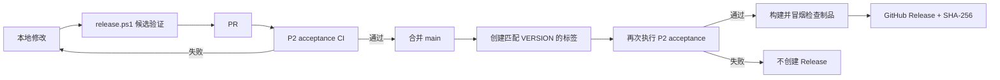

# Siftlane P2 发布固化 PRD

## 1. 摘要

本 PRD 定义 Siftlane P2 从“功能验收通过”到“可重复发布”的完整闭环。目标是让每次变更都经过同一套自动验收，并让 `v0.2.0` 标签只能从版本一致、测试通过、能够生成可校验制品的提交发布。

## 2. 联系人

| 名称 | 角色 | 说明 |
| --- | --- | --- |
| 仓库维护者（待确认） | 产品与发布负责人 | 批准合并、创建标签、处理回滚 |
| 仓库管理员（待确认） | GitHub 管理员 | 将 P2 acceptance 配置为 `main` 必需检查 |
| Codex | 实施者 | 编写本 PRD、发布脚本、CI 和验收证据 |

## 3. 背景

Siftlane 已完成 P1 和 P2 功能验收。后端 26 项测试、前端生产构建和 3 项浏览器测试已在同一次本地验证中通过。分支、有限循环与分页、重试、检查点恢复和时区调度已经形成产品闭环。

但仓库仍缺少发布闭环：前后端版本停留在 `0.1.0`；GitHub 没有 CI；没有标签与版本一致性门禁；没有可复现的前后端制品、制品清单和 SHA-256 校验和；也没有发布与回滚手册。继续开发会让“P2 已完成”只是一份本地结论，无法成为可审计的发布事实。

现在固化发布流程，可以把现有验收资产变成后续 P3 的稳定基线，并尽早阻止版本漂移和无法复现的发布。

## 4. 目标

### 4.1 目标

建立一条从本地候选验证、拉取请求 CI、主分支保护、版本标签、制品构建到 GitHub Release 的单向发布路径。任何必需检查失败，都不得产出正式 Release。

这会为维护者提供明确的发布判定，为使用者提供可校验的下载制品，也为 P3 开发保留一个可回退的 P2 基线。

### 4.2 关键结果

| ID | SMART 关键结果 | 验收方式 |
| --- | --- | --- |
| KR-01 | 每个指向 `main` 的 PR、每次 `main` 推送和手动触发都在 Windows runner 上执行完整 P1/P2 门禁 | GitHub Actions `P2 acceptance` 工作流 |
| KR-02 | 一次根验证命令同时通过后端、生产构建、端到端测试和发布元数据检查 | `scripts/verify.ps1` 返回 0 |
| KR-03 | `VERSION`、Python 包、运行时 API、Web 包和 lockfile 全部为 `0.2.0` | `scripts/check-release.ps1` 返回 0 |
| KR-04 | 本地候选命令生成 wheel、sdist、Web zip、JSON 清单和 SHA-256 清单，并对 wheel 与 Web zip 做安装/解压冒烟检查 | `scripts/release.ps1` 返回 0 |
| KR-05 | 只有与仓库版本完全匹配的 `v0.2.0` 标签才能在完整 CI 通过后创建 GitHub Release | `Release` 工作流依赖可复用 CI 工作流 |
| KR-06 | 发布负责人可以按文档完成发布、验证和回滚，且不依赖未记录的本机知识 | `documentation/release.md` 人工评审 |

## 5. 市场细分

### 5.1 维护和发布 Siftlane 的工程人员

他们需要判断某个提交是否真的能发布，并希望一次命令覆盖所有强制检查。他们受 Windows 开发环境、Python 虚拟环境路径和 Playwright 浏览器可用性的约束。

### 5.2 部署 Siftlane 的单人或小型数据团队

他们需要知道下载内容对应哪个版本，并能在部署前验证文件未损坏。他们不需要 npm 或 PyPI 公共发布，但需要可下载的后端包、前端静态文件和明确的升级要求。

### 5.3 继续开发 P3 的贡献者

他们需要一个不会悄悄回归的 P2 基线。每次 PR 都应自动证明 P1/P2 仍然成立，而不是依赖某位开发者的本地服务和数据库。

## 6. 价值主张

| 用户任务 | 当前痛点 | P2 发布固化后的收益 |
| --- | --- | --- |
| 判断能否合并 | 只有本地测试结论，无法强制执行 | PR 上出现统一、可复查的验收结果 |
| 创建正式版本 | 多处版本号可能不一致 | 标签、运行时和包元数据必须完全匹配 |
| 下载和部署 | 没有标准制品与完整性证明 | 获得 wheel、sdist、Web zip 和 SHA-256 |
| 处理失败发布 | 缺少明确停止与回滚条件 | 按发布手册停止、撤回 Release 或回退部署 |
| 开始 P3 | P2 基线可能被后续修改破坏 | 每次变更自动回归完整 P1/P2 闭环 |

与“只跑单元测试”相比，本方案覆盖真实生产构建和浏览器操作；与“开发者手动打包”相比，本方案从标签提交重新构建并记录校验和。

## 7. 方案

### 7.1 操作流程

维护者不需要新的图形界面。根脚本给出明确步骤和非零退出码；GitHub Actions 展示同一门禁的远程结果；GitHub Release 承载最终下载内容。

### 7.2 关键功能

#### F-01 单一版本基线

- 根目录 `VERSION` 保存候选版本。
- Python 项目、Python 运行时、FastAPI 元数据、健康检查、Web package 和 lockfile必须与它一致。
- 标签必须使用 `v<version>` 格式。

#### F-02 根验收门禁

- `scripts/verify.ps1` 继续执行后端测试、TypeScript/Vite 生产构建和 P1/P2 Playwright。
- 验收完成后执行发布元数据检查。
- 服务必须使用隔离数据库，并在结束后释放 5173、8090 和 8877 端口。

#### F-03 持续集成

- `P2 acceptance` 在 PR、`main` 推送、手动触发和其他工作流调用时运行。
- 首版固定使用 `windows-latest`、Python 3.11、Node 20.19 和 runner 自带 Chrome。
- 无论成功或失败，都保留可用的截图、trace 和测试报告。
- 仓库管理员必须把 `P2 acceptance / acceptance` 设为 `main` 的必需检查。

#### F-04 候选制品

- 构建 Python wheel 和 sdist。
- 构建 Web 生产目录并压缩为 zip。
- 生成包含版本、提交、工作区状态、文件大小和哈希的 JSON 清单。
- 生成独立 `SHA256SUMS.txt`。
- 在发布前安装 wheel 并解压 Web zip，确认版本与入口文件有效。

#### F-05 标签发布门禁

- `Release` 只监听 `v*` 标签。
- 它先调用完整 `P2 acceptance`，再从同一标签提交构建制品。
- 标签与 `VERSION` 不一致时立即失败。
- 验证和打包都成功后，才使用 `documentation/releases/v0.2.0.md` 创建 GitHub Release。

#### F-06 发布和回滚手册

- 文档列出准备、候选验证、分支保护、打标签、发布后验证和回滚步骤。
- 正式发布不自动推送 npm 或 PyPI，避免未经授权的外部发布面。

### 7.3 技术方案

- CI 采用 GitHub Actions 可复用工作流，发布工作流通过 `needs` 依赖完整验收。
- 本地和 CI 共用 PowerShell 脚本，减少两套流程产生的差异。
- Python 使用项目虚拟环境；前端使用 `npm ci`；浏览器测试由现有服务编排器启动独立 FastAPI、fixture server 和 Vite。
- 发布制品生成在忽略目录 `release-artifacts/`，不会进入源码提交。
- GitHub Release 使用 Actions 自带 `GITHUB_TOKEN`，权限只在发布工作流中提升为 `contents: write`。

### 7.4 假设

- GitHub 仓库允许 Actions 运行，并允许发布工作流写入 Release。
- `windows-latest` 继续提供 Chrome；如果 runner 镜像变化，需要切换到 Playwright 管理的 Chromium。
- P2 仍面向单节点、单信任边界部署；认证、资源权限、连接器隔离和运行监控属于 P3。
- `v0.2.0` 是首个正式 P2 版本号。标签创建前仍可修改候选内容，但版本号必须保持一致。
- 分支保护和首次标签创建需要仓库管理员权限，不能仅靠未推送的本地文件完成。

## 8. 发布

### 8.1 首版范围

本次 P2 固化包含版本 `0.2.0`、根验收门禁、CI、标签发布工作流、三类可下载制品、校验和、发布说明、发布手册和回滚条件。预计一个短迭代内完成；本地验证通过后即可提交评审。

### 8.2 后续范围

- 将 Linux runner 加入矩阵，并消除 Windows 虚拟环境路径依赖。
- 增加制品签名、SBOM、依赖漏洞扫描和容器镜像发布。
- 增加预发布版本和自动生成变更日志。
- 在 P3 中加入认证用户、资源权限、连接器进程隔离和运行监控。

### 8.3 验收清单

| ID | 必须结果 | 自动证据 | 状态 |
| --- | --- | --- | --- |
| RH-01 | 所有 P1/P2 功能门禁在同一次根验证中通过 | `scripts/verify.ps1` | 已通过 |
| RH-02 | 所有产品版本为 `0.2.0`，标签规则可阻止不匹配版本 | `scripts/check-release.ps1` | 已通过 |
| RH-03 | PR、main、手动和工作流调用均有 Windows CI | `.github/workflows/ci.yml` | 已通过；分支保护治理项见 `ACCEPTANCE.md` 的 GOV-01 |
| RH-04 | 标签发布必须依赖完整 CI | `.github/workflows/release.yml` | 已通过 |
| RH-05 | 候选命令生成并冒烟检查全部制品和校验文件 | `scripts/release.ps1` | 已通过 |
| RH-06 | 发布说明、操作步骤、停止条件和回滚步骤完整 | `documentation/release.md` | 已通过 |
| RH-07 | 本地验证结束后测试端口全部释放 | Playwright 服务编排器与端口检查 | 已通过 |

### 8.4 正式发布判定

只有 RH-01 至 RH-07 全部通过、变更已提交并推送且 `v0.2.0` 标签工作流成功后，`v0.2.0` 才可称为“正式发布”。在此之前状态为“P2 功能完成，`v0.2.0` 发布候选就绪”。

当前结果：`v0.2.0` 标签工作流成功，GitHub Release 与五个资产已经发布并通过下载后校验。由于本次操作没有修改或确认 GitHub 分支保护，仓库管理员仍需确认 `P2 acceptance / acceptance` 是 `main` 的必需检查。该治理债务记录为 `ACCEPTANCE.md` 的 GOV-01，不改写已经发生的 P2 发布事实，但会阻断 P3 正式发布。
