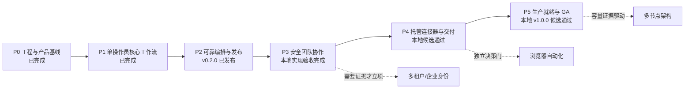

# Siftlane 产品生命周期闭环 PRD

## 1. 摘要

本文档是 Siftlane 从工程基线到正式可用版本的主 PRD。它把产品演进划分为 P0-P5 六个有依赖关系的阶段，并为每个阶段定义用户价值、范围、非目标、进入条件、退出条件、发布和回滚要求。

阶段完成不等于代码已经存在。只有对应的强制验收项、测试、文档、发布和回滚证据全部满足，阶段才可以晋级；逐项证据以 [ACCEPTANCE.md](ACCEPTANCE.md) 为准。

## 2. 联系人

| 名称 | 角色 | 责任 |
| --- | --- | --- |
| 仓库维护者（待确认） | 产品负责人 | 确认阶段目标、范围和晋级决定 |
| 发布负责人（待确认） | 工程与发布负责人 | 执行验收、版本发布、发布后检查和回滚 |
| 仓库管理员（待确认） | GitHub 管理员 | 配置分支保护、必需检查和发布权限 |
| 安全负责人（P3 前确认） | 安全评审人 | 审查身份、权限、审计、隔离和威胁模型 |
| 运维负责人（P5 前确认） | 生产责任人 | 审查容量、备份、恢复、SLO 和值班手册 |

角色可以由同一人兼任，但验收记录必须写明实际确认人。自动化不能替代产品、安全或运维决策。

## 3. 背景

Siftlane 是一个独立的 Python 和 React 爬虫工作流产品。当前架构由 React 控制台、FastAPI 引擎、异步 Worker/调度器、SQLite WAL 存储和 Connector SDK 组成。系统已经支持可视化 DAG、受控 HTTP 采集、结构化提取、持久运行、可恢复事件流、结果检查、条件分支、有限循环与分页、重试、检查点恢复和时区调度。

截至本 PRD 建立时，P1 和 P2 功能验收已通过，`v0.2.0` 已由标签工作流发布。基线证据包括 26 项后端测试、生产 Web 构建、3 项 Playwright 测试、可复现发布制品和下载后 SHA-256 校验。P2 已形成可回退的正式版本。

目前的主要限制也很明确：系统假设单一可信部署边界；没有用户、角色、资源所有权和细粒度权限；第三方连接器与引擎同进程执行；没有正式容量边界、SLO、备份恢复演练或 GA 运维承诺。继续直接叠加功能，会把安全和运维风险带入生产使用。

因此下一步不是无限扩展功能列表，而是按顺序关闭团队协作、连接器交付和生产运行三个风险面。每个阶段都必须保留前序回归门禁，并留下可执行的停止和回滚路径。

## 4. 目标

### 4.1 总目标

将 Siftlane 从已发布的单操作员工作流工具，推进为可由小型团队安全使用、可扩展连接和交付、并能在明确单节点边界内稳定运行的 `v1.0.0` 产品。

### 4.2 产品原则

- 可检查：流程定义、运行事件、结果、权限决定和交付记录都能追溯。
- 默认受控：网络请求、循环、重试、调度、连接器和密钥都有明确边界。
- 失败可恢复：运行、交付、升级和发布均有幂等、恢复或回滚路径。
- 证据优先：没有验收证据，不声明阶段完成或版本可发布。
- 先单节点：在容量数据证明需要之前，不承诺多节点或多租户架构。

### 4.3 关键结果

| ID | SMART 关键结果 | 最迟验收点 |
| --- | --- | --- |
| KR-01 | P0-P2 的历史能力在每次后续发布候选中持续通过统一自动门禁 | 每个 P3-P5 候选版本 |
| KR-02 | P3 提供可测试的用户身份、角色、资源所有权、审计和连接器隔离，跨权限访问测试为零容忍失败 | `v0.3.0` 发布前 |
| KR-03 | P4 至少完成一个真实参考连接器和一种可靠外部交付方式，并以幂等重试证明不会重复交付 | `v0.4.0` 发布前 |
| KR-04 | P5 形成经过演练的备份、恢复、升级和回滚流程，所有恢复目标和单节点容量边界都有测量报告 | `v1.0.0` 发布前 |
| KR-05 | 每个阶段的所有强制验收项均有自动或人工证据，失败、跳过和缺失证据均阻断该阶段发布 | 每次阶段晋级 |
| KR-06 | `v1.0.0` 发布后仍有可验证的上一稳定版本、制品校验和、迁移说明和回退方案 | GA 发布后检查 |

### 4.4 成功边界

本路线以可审计的单节点 GA 为终点，不用尚未验证的市场假设驱动多租户、商业计费、连接器市场或分布式调度。上述能力只能在有客户需求、容量数据和单独 PRD 后进入后续路线。

## 5. 市场细分

### 5.1 单人数据操作员

他们需要在本机或受控服务器上创建、运行和排查采集流程。他们关心低安装成本、明确结果和失败恢复，不需要复杂的企业管理能力。P1-P2 已覆盖其主要任务。

### 5.2 小型数据与运营团队

他们共享同一部署，需要知道谁能查看、修改、运行或调度哪些流程。他们需要审计和安全隔离，但未必需要企业级多租户。P3 面向这一任务。

### 5.3 集成与交付负责人

他们要连接真实数据源、管理凭据，并把结果可靠交付到文件或外部系统。他们需要版本兼容、幂等重试和可排查的交付历史。P4 面向这一任务。

### 5.4 自托管运维负责人

他们要在已知资源范围内升级、备份、恢复和监控服务，并能判断事故是否需要回滚。P5 面向这一任务。

## 6. 价值主张

| 用户任务 | 当前痛点 | 阶段完成后的价值 |
| --- | --- | --- |
| 设计并运行采集流程 | 脚本分散，状态和结果难追踪 | P1 提供可视 DAG、结构化配置、运行事件和结果闭环 |
| 让任务长期可靠运行 | 分支、分页、失败重试和定时执行需要人工拼接 | P2 提供有界编排、恢复、调度和可复现发布 |
| 多人安全共享系统 | 一个令牌拥有全部权限，操作无法归责 | P3 提供身份、所有权、权限、审计和隔离 |
| 接入来源并交付结果 | 插件、密钥和外发失败缺少统一治理 | P4 提供受管连接器、作用域密钥和可靠交付记录 |
| 承担生产工作负载 | 容量、备份、升级和故障目标未知 | P5 给出经过验证的运行边界、SLO、恢复和 GA 承诺 |

Siftlane 的差异不在于支持任意代码，而在于让采集和交付过程可视、受控、可恢复和可审计。

## 7. 方案

### 7.1 用户与阶段流程

每个阶段采用同一闭环：确认进入条件，冻结范围，完成实现，执行自动验收，完成人工评审，构建候选，演练升级与回滚，发布，执行发布后检查，然后记录晋级决定。

### 7.2 阶段总表

| 阶段 | 状态 | 版本里程碑 | 核心结果 | 依赖 |
| --- | --- | --- | --- | --- |
| P0 | 已完成（追溯确认） | 工程基线，无独立发布标签 | 产品边界、架构、设计、测试和文档可追溯 | 无 |
| P1 | 已完成 | `0.1.x` 功能基线，未声明独立正式 Release | 单操作员从建图到结果检查的核心闭环 | P0 |
| P2 | 已完成并发布 | `v0.2.0` | 可靠编排、恢复、调度和发布闭环 | P1 |
| P3 | 功能与本地验收完成；正式发布被治理门禁阻断 | `v0.3.0` 本地候选 | 单部署内的安全团队协作 | P2；关闭分支保护治理债务 |
| P4 | 功能与本地候选完成；正式发布被前序/治理门禁阻断 | `v0.4.0` 本地候选 | 受管连接器、密钥和可靠数据交付 | P3 正式发布 |
| P5 | 本地 GA 候选门禁通过；正式 GA 被前序/治理/外部证据阻断 | `v1.0.0` 本地候选 | 明确边界内的生产运行和 GA | P4 正式发布；Linux/治理/人工证据 |

版本号是目标，不是承诺。范围发生破坏性变化时，必须在发布评审中重新决定版本号。

### 7.3 通用晋级与发布门禁

1. 上一阶段必须完成，且其自动回归在当前候选提交上通过。
2. 当前阶段所有 `Mandatory` 验收项必须为 `Passed`；`Failed`、`Skipped`、`Blocked`、`Planned` 或缺少证据都不能晋级。
3. 自动证据必须来自同一候选提交。人工证据必须记录评审人、日期、结论和关联制品。
4. 数据模型、API 或配置变化必须有前向迁移、兼容说明和可演练的回滚方案。
5. 正式版本只能由匹配 `VERSION` 的标签工作流生成；本地候选不能替代远端发布门禁。
6. 发布后必须校验健康、核心用户路径、制品哈希和迁移结果。失败时停止推广并执行阶段定义的回滚。
7. 紧急修复不得删除既有门禁。无法运行的门禁必须记录例外批准，并在下一个正常版本前补齐；例外版本不推动阶段状态。

### 7.4 P0：产品边界与工程基础

**目标：** 建立一个可以继续开发和验证的独立产品基线。

**范围：** 产品事实与非目标、组件和信任边界、受控 HTTP 策略、设计系统与原型、版本化 API、基础测试结构、架构与操作文档。

**非目标：** 完整业务流程、团队权限、第三方连接器运行、生产 SLO。

**进入条件：** 仓库可构建；产品名称和独立性约束已确认。

**退出条件：** 产品边界、架构和安全假设写入仓库；基础服务可启动；关键策略有自动测试；后续需求可引用稳定文档。

**发布与回滚：** P0 不要求独立 Release。基线变更通过版本控制回退；任何改变产品边界的工作必须同步更新主 PRD 和架构文档。

### 7.5 P1：单操作员核心工作流

**目标：** 让一个可信操作员在浏览器内完成“创建流程、配置节点、运行、观察、查看结果”的完整任务。

**范围：** 可视化 DAG 编辑；Schema 驱动配置；HTTP、提取、转换和输出节点；保存与删除；队列和取消；持久事件与可恢复 SSE；运行快照；结果表；重启恢复；Connector SDK v1 边界；桌面和移动基本可用性。

**非目标：** 条件分支、循环、重试、调度、多人权限、连接器安装和外部交付。

**进入条件：** P0 完成；节点和流程数据模型稳定到可以形成端到端样例。

**退出条件：** 固定四节点流程从浏览器运行后恰好写入两个规范化结果；异常配置被拒绝；运行事件、取消和恢复有自动证据；移动端无页面级横向溢出。

**发布与回滚：** P1 形成 `0.1.x` 功能基线，但本仓库不追溯声明独立正式 Release。回归时回退到最后通过 P1 门禁的提交和兼容数据库。

### 7.6 P2：可靠编排、恢复、调度与发布

**目标：** 让工作流在分支、分页、瞬时失败、进程重启和定时触发下仍保持有界、幂等和可恢复，并形成正式发布路径。

**范围：** `true`/`false` 条件端口；有限循环与分页；有界指数退避重试；校验和检查点；精确无重复恢复；时区 cron、租约和幂等触发；调度控制台；统一验证命令；CI；版本一致性；制品、清单、SHA-256、标签 Release 和回滚手册。

**非目标：** 用户和角色、资源权限、连接器进程隔离、外部 Webhook、多节点调度。

**进入条件：** P1 完成；P1 回归可以由隔离环境自动执行。

**退出条件：** P1/P2 后端、生产构建和浏览器测试在同一提交通过；发布制品可重建和冒烟安装；匹配版本的标签工作流成功；发布后下载资产通过校验。

**发布与回滚：** `v0.2.0` 已发布。功能或迁移失败时停止新部署，恢复上一稳定制品和数据库备份；错误标签或资产按发布手册撤回，不复用已发布标签。`main` 必需检查的管理员确认作为公开治理债务，必须在 P3 发布前关闭。

### 7.7 P3：安全团队协作

**目标：** 让多个已识别用户在同一部署中按职责共享流程，同时阻止越权访问并保留可追责记录。

**范围：** 用户身份和安全会话；最小角色模型；流程资源所有权；流程、运行、结果和调度权限；服务端逐资源授权；审计日志；连接器进程或容器隔离；安全健康指标与告警；认证和越权 E2E；威胁模型；数据迁移和回滚。

**非目标：** SaaS 多租户隔离、企业 SSO/SCIM、公开注册、计费、连接器市场。外部身份提供商只能在有明确需求和单独设计后加入。

**进入条件：** P2 已发布；分支保护必需检查已由管理员确认；角色、资源所有权和会话威胁模型已评审；现有单令牌部署有迁移方案。

**退出条件：** 默认安装不能以空令牌暴露受保护 API；每种角色的允许和拒绝路径都有服务端测试；跨用户资源访问被拒绝；权限变更和敏感操作进入不可由普通用户篡改的审计记录；连接器故障不能直接破坏引擎进程；告警和恢复路径完成演练。

**发布与回滚：** 目标 `v0.3.0`。候选必须测试从 `v0.2.0` 升级以及回滚前的数据兼容。认证或授权绕过、会话失效、审计丢失、隔离逃逸均为停止发布条件；已部署版本应禁用外部访问或回退到受控维护模式后再恢复数据。

### 7.8 P4：托管连接器与数据交付

**目标：** 让管理员安全管理连接器和密钥，让操作员把结果可靠交付到系统外部。

**范围：** 隔离环境中的连接器安装、启停、版本和兼容性管理；作用域密钥；至少一个真实参考连接器；文件导出和/或 Webhook 交付；签名或认证；有界重试；幂等键；死信或人工重放；交付历史和运维界面。

**非目标：** 未审查代码直接进入引擎进程、公开连接器市场、任意脚本执行、默认纳入浏览器自动化。浏览器自动化必须经过合法性、资源、隔离和维护成本的独立决策门。

**进入条件：** P3 已发布；连接器隔离和权限边界通过安全评审；目标数据源和交付方有真实需求、测试账号和数据处理约束。

**退出条件：** 参考连接器可安装、升级、禁用和卸载；密钥不会出现在普通 API、日志或导出中；相同交付重试不会产生重复业务结果；失败交付可查询和受控重放；兼容性错误在安装或升级前被阻止。

**发布与回滚：** 目标 `v0.4.0`。连接器和主程序分别记录版本与兼容范围。错误连接器可单独禁用或回退，不需要回退整个引擎；交付故障先暂停目标，再处理积压，不能无界重试。

### 7.9 P5：生产就绪与 GA

**目标：** 在明确的单节点容量和支持边界内，让维护者可以部署、监控、升级、备份和恢复 Siftlane，并正式发布 `v1.0.0`。

**范围：** 单节点容量基线；性能、并发和长稳测试；备份与恢复；升级和数据迁移演练；Linux 和文档化部署方式验证；健康、指标、日志、SLO 和告警；API 兼容策略；依赖与安全审查；关键界面无障碍审查；运维、事故和回滚手册；GA Release。

**非目标：** 未经数据证明的多节点、自动扩缩容、跨区域容灾、托管 SaaS、多租户 SLA。

**进入条件：** P4 已发布；代表性工作负载和资源规格已定义；生产责任人、SLO 和支持边界已确认；备份目标位置和数据保留政策已批准。

**退出条件：** 发布文档给出可复现的容量上限和降级行为；长稳和峰值测试满足门槛；备份恢复达到声明的 RPO/RTO；从上一稳定版本升级和回滚演练成功；Linux 部署、告警、事故流程、安全和无障碍检查全部通过；已知限制公开。

**发布与回滚：** 目标 `v1.0.0`。先发布候选并在代表性环境观察，再提升为 GA。SLO、迁移、恢复、数据完整性或安全门禁失败时不得 GA；发布后异常按严重级别停止推广、回滚应用、恢复数据并记录事故复盘。

### 7.10 明确的后续决策门

| 候选方向 | 进入决策所需证据 | 未满足时的处理 |
| --- | --- | --- |
| 多租户 | 至少两个隔离客户空间的真实需求、数据隔离与运维成本评估 | 保持单部署边界 |
| 企业身份 | 明确的 OIDC/SAML/SCIM 客户要求和身份供应商测试条件 | 保持内建最小身份模型 |
| 浏览器自动化 | HTTP 方案无法完成的目标、合法性评审、资源和隔离预算 | 不进入 P4 默认范围 |
| 多节点 | 单节点容量测试证明瓶颈且无法通过垂直扩展解决 | 公开容量边界，不承诺集群 |
| 商业化与计费 | 已验证的付费对象、价值指标和合规要求 | 不在技术路线中预埋计费复杂度 |

### 7.11 假设

- 首批使用者接受自托管和单节点部署。
- SQLite 在 P5 测得的容量范围内仍是持久化边界；若数据否定该假设，需要独立存储迁移 PRD。
- 小型团队需要可归责的协作，但当前没有证据要求 SaaS 多租户。
- 参考连接器和交付目标要由真实使用场景选择，不能仅为展示而实现。
- 每个阶段可以拆成多个迭代，但不能绕过阶段退出门禁发布对应里程碑版本。

## 8. 发布

### 8.1 发布节奏

每个阶段采用相对节奏：范围与风险评审、实现迭代、候选冻结、完整验收、发布后观察。本文不承诺日期；负责人根据验收项、风险和团队容量决定迭代数量。

### 8.2 版本与兼容

- P3、P4 使用 `0.x` 次版本，允许在清楚说明和迁移工具支持下调整未稳定接口。
- P5 发布 `v1.0.0` 后，公开 API、流程定义、连接器 SDK 和持久数据格式必须遵循书面兼容策略。
- 修复版本只能修复缺陷或安全问题，不得借修复版本绕过阶段范围评审。
- 每个 Release 必须包含变更、升级、已知限制、制品哈希和回滚说明。

### 8.3 当前发布判定

- P0：追溯验收完成。
- P1：功能验收完成，无独立正式 Release 声明。
- P2：功能与发布闭环完成，`v0.2.0` 已正式发布。
- P3：身份、权限、审计、隔离、迁移和浏览器实现已完成本地验收；由于进入/正式发布治理证据未关闭，只能称为本地候选，不能称为正式发布。
- P4：连接器、密钥、交付、控制台与 `v0.4.0` 本地制品门禁已通过；由于 P3 未正式发布，只能保留本地候选事实。
- P5：实现、文档和 `v1.0.0` 本地 GA 候选门禁已通过；当前候选来自 dirty worktree，不是正式制品。仍须完成远端 Windows/Linux CI、分支保护、具名人工评审、干净提交制品和发布后检查后才可晋级 GA。
- 治理债务：2026-08-01 GitHub 只读 API 显示 `main protected=false` 且 repository rulesets 为空。仓库管理员仍须配置并签署 `P2 acceptance / acceptance` 与 `P2 acceptance / linux deployment` 为 `main` 必需检查；该项不改写已经发生的 `v0.2.0` 发布事实，但阻断 P3/P4/P5 正式发布。

### 8.4 验收与决策记录

逐项状态、自动证据、人工证据和晋级决定维护在 [ACCEPTANCE.md](ACCEPTANCE.md)。阶段发布后不得删除历史证据；发现错误时追加更正、影响范围和处理结论。
