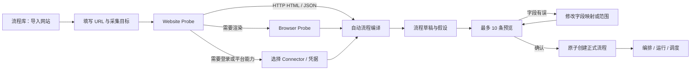
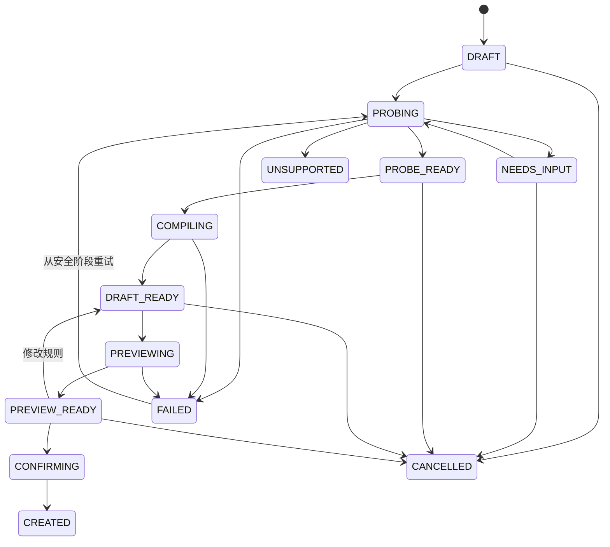
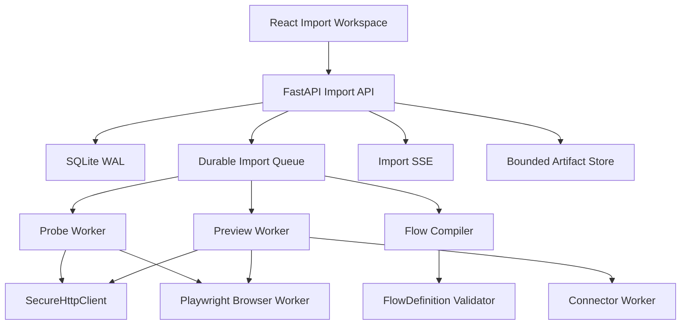

# SiftLane 网站一键导入与自动爬虫闭环 PRD

> 状态：Draft for implementation  
> 范围：Website Probe、自动流程编译、Browser Executor、结果预览确认  
> 平台：桌面 Web + 独立 Python 执行引擎  
> 约束：不执行任意用户 Python/JavaScript，不承诺绕过验证码、登录限制或网站安全策略

## Implementation Progress

**Updated:** 2026-08-03

| Workstream | Status | Notes |
| --- | --- | --- |
| Import Job persistence | Implemented | SQLite `website_imports` and isolated `preview_items`; schema version 6. |
| Import API control plane | Implemented | Create, list/get, probe, compile, preview, preview-items, confirm, persistent event reads, and SSE stream endpoints. |
| HTTP Probe | Implemented | Reuses `SecureHttpClient`; URL, robots, redirect, DNS/IP and response-size policy remain enforced. |
| Compiler v1 | Implemented | Deterministic HTTP HTML/JSON draft generation validated by `FlowDefinition`. |
| Preview isolation | Implemented | Preview is capped at 10 items and is stored separately from formal run `items`. |
| Confirm | Implemented | Confirm validates the persisted draft and creates a formal Flow; repeat confirm returns the created Import Job. |
| Browser Executor | Partial | `browser_request` is a bounded, short-lived Chromium node with explicit allowlist and resource blocking. It passed a local Chrome render -> HTML extract -> emit smoke test. Worker pool, screenshots, redaction, actions and crash recovery remain pending. |
| Web Import Workspace | Implemented | React flow supports URL/intent, probe, compile, isolated preview and confirm. Import SSE is exposed by the API; event timeline UI remains pending. |
| Full release acceptance | Blocked | Existing HTTP fixture regression is now fixed by disabling environment proxy inheritance in `SecureHttpClient`: `test_api.py` passes 6/6. Full engine run is 47 passed / 3 failed, all in pre-existing P4 connector/install/webhook integration paths. Import-specific fixture, Browser worker-pool, and Web E2E acceptance remain pending. |

The implementation deliberately does not fall back to arbitrary scripts or bypass the existing network security controls. Browser and connector paths are not represented as successful behavior until their dedicated runtimes exist.

## 1. Summary

本 PRD 定义 SiftLane 的“输入网站即可开始采集”闭环。用户输入网址和采集目标后，系统探测网站类型，生成可编辑的标准流程，执行少量预览，用户确认后再创建正式流程并进入运行与调度。

该能力不是一个黑盒脚本生成器。所有自动结果都必须编译成 SiftLane 已有的声明式 DAG，经过安全检查、流程校验和预览确认后才能保存。

## 2. Contacts

| 角色 | 负责人 | 责任 |
| --- | --- | --- |
| 产品负责人 | 项目所有者 | 决定支持的网站范围、成功标准和发布门槛 |
| Web 前端 | SiftLane Web | 导入入口、探测进度、字段预览、修正和确认流程 |
| 引擎与 API | SiftLane Engine | Import Job、Probe、Compiler、Preview、权限和持久化 |
| 浏览器运行时 | Browser Executor | Playwright 隔离、页面渲染、有限动作和资源治理 |
| 连接器体系 | Connector SDK | 登录型或平台专用网站的能力声明和执行交接 |
| 安全与运维 | 项目维护者 | SSRF、凭据、robots、审计、配额、监控和回滚 |
| 质量保证 | 项目维护者 | 固定测试站点、浏览器回归、恢复测试和发布验收 |

## 3. Background

### 3.1 当前能力

SiftLane 已有以下基础：

- 声明式流程 DAG 和版本化流程快照。
- `start`、`http_request`、`html_extract`、`json_extract`、`condition`、`loop`、`pagination`、`transform`、`emit` 节点。
- 重试、检查点、取消、恢复、SSE 事件和幂等结果写入。
- SSRF、DNS/IP、robots.txt、限速、重定向、超时和响应大小限制。
- Connector SDK v1、凭据引用、子进程执行和连接器生命周期。
- 流程库、编排画布、运行记录、结果查看和任务调度。

### 3.2 当前缺口

现有用户必须手工完成以下工作：

1. 判断网站是静态 HTML、JSON API 还是 JavaScript 渲染。
2. 找到列表容器、详情链接、分页方式和字段选择器。
3. 手工搭建列表、循环、详情请求和输出节点。
4. 运行完整流程后才能发现字段为空、重复或取错内容。

系统目前明确不支持 Browser Automation。因此，“输入网址后自动生成可运行爬虫”尚未形成闭环。

### 3.3 Why Now

- P1/P2 已经提供稳定 DAG、重试、检查点和幂等写入，自动生成的流程有可靠执行底座。
- Connector SDK 已经提供平台型网站的扩展边界，不需要把所有网站能力塞进核心引擎。
- 新流程库子模块可以承载“导入网站”入口和导入任务历史。
- 浏览器执行器可以作为独立 Worker 引入，不需要破坏 API 进程和现有 HTTP Worker。

### 3.4 产品边界

本版本不做：

- 验证码破解、设备指纹伪造、代理池轮换或主动反检测。
- 绕过付费墙、访问控制、robots 禁止或网站服务条款。
- 自动创建账号、自动购买、发布内容或执行不可逆网站操作。
- 执行用户提供或模型生成的任意 Python、JavaScript、Shell。
- 无边界镜像整个网站。
- 保证任何网址都能一键成功。
- 移动端导入和编辑体验。

## 4. Objective

### 4.1 Objective

让用户在不了解 CSS Selector、分页实现和渲染方式的情况下，用“网站地址 + 采集目标”得到一个安全、可预览、可编辑、可运行和可调度的 SiftLane 流程。

### 4.2 Key Results

| KR | 指标 | 验收目标 |
| --- | --- | --- |
| KR1 | 固定站点集首次生成成功率 | 静态 HTML、JSON API、JS 渲染三类测试站点中，至少 90% 能生成通过 DAG 校验的流程 |
| KR2 | 首次预览时间 | HTTP 站点 P50 小于 30 秒；Browser 站点 P50 小于 60 秒 |
| KR3 | 预览有效率 | 列表型成功预览至少返回 3 条记录，详情页至少返回 1 条；目标必填字段非空率不低于 80% |
| KR4 | 预览与正式运行一致性 | 同一版本流程前 10 条记录的字段结构一致率不低于 95% |
| KR5 | 安全边界 | 测试集中的私网跳转、DNS 重绑定、非法协议、下载和跨域越界全部被阻止 |
| KR6 | 幂等确认 | 同一个确认请求最多创建一个正式流程，重复请求返回同一结果 |
| KR7 | 可解释性 | 每个自动字段都展示来源选择器、样本值、置信度和警告，不允许只给出黑盒结论 |
| KR8 | 恢复能力 | Probe、Compile 或 Preview 中断后可从最近完成阶段继续，不重复创建流程或写入正式结果 |

### 4.3 Definition of Done

用户从“导入网站”开始，能够完成以下链路：

```text
输入网址和目标
  -> 查看网站探测结论
  -> 查看自动流程草稿
  -> 运行有限预览
  -> 修正字段并再次预览
  -> 确认创建流程
  -> 进入编排、正式运行或创建调度
```

任何不支持的网站都必须给出明确原因和下一步，不能停在无限加载或笼统报错。

## 5. Market Segments

### 5.1 非技术研究人员

**工作任务：** 输入新闻、公告、商品或资料网站，快速得到结构化数据。  
**限制：** 不理解 DOM、CSS Selector、JSONPath 或浏览器网络请求。

### 5.2 数据工程师

**工作任务：** 快速生成可靠起点，再进入流程图精确调整、调度和交付。  
**限制：** 不愿为每个普通网站重复搭建列表页与详情页模板。

### 5.3 团队负责人

**工作任务：** 让团队成员在权限、审计和资源限制下自助创建采集任务。  
**限制：** 不能接受黑盒代码、凭据泄露、无限浏览器任务和不可解释结果。

### 5.4 Connector 开发者

**工作任务：** 为需要登录、游标 API 或平台规则的网站提供专用能力。  
**限制：** 核心引擎不能了解每个平台细节，连接器必须保留独立升级和回滚边界。

## 6. Value Propositions

| 用户任务 | 当前痛点 | 新价值 | SiftLane 的差异 |
| --- | --- | --- | --- |
| 判断网站怎么抓 | 需要先看源码和网络请求 | Probe 自动给出执行策略和证据 | 策略结果可解释，可交给 HTTP、Browser 或 Connector |
| 创建流程 | 手工连接多个节点 | Compiler 生成标准 DAG 草稿 | 生成的是可编辑、可版本化流程，不是一次性脚本 |
| 抓取 JS 页面 | HTTP 返回空壳 | Browser Executor 渲染并执行有限动作 | 独立 Worker、资源有界、所有网络请求继续执行安全策略 |
| 确认字段正确 | 完整运行后才发现错误 | 最多 10 条预览，字段和来源并排显示 | 修正后可再次预览，不污染正式结果 |
| 上线采集任务 | 预览和正式执行逻辑不同 | 确认后复用同一 DAG 和执行器 | 预览与正式运行使用同一流程定义和编译版本 |
| 处理不支持网站 | 只有失败信息 | 给出缺登录、robots 禁止、需要 Connector 等明确状态 | 不把安全拒绝伪装成选择器错误 |

## 7. Solution

### 7.1 UX And User Flow

#### 7.1.1 主流程



#### 7.1.2 Import Job 状态机



`UNSUPPORTED` 是明确的产品结果，不等同于系统故障。`CREATED`、`CANCELLED` 和 `UNSUPPORTED` 是终态。

#### 7.1.3 页面结构

**A. 流程库**

- 主操作增加“导入网站”。
- 页面显示导入任务的当前阶段、网站、创建人、更新时间和结果流程。
- 已完成导入跳转到正式流程；未完成导入恢复到上次阶段。

**B. 新建导入任务**

- 必填：网站 URL、采集目标描述。
- 推荐字段：标题、正文、链接、作者、时间、图片或用户自定义字段。
- 范围：是否进入详情页、预览页数、同域限制、最大项目数。
- 执行偏好：自动、仅 HTTP、允许 Browser、指定 Connector。
- 凭据只选择 Secret Reference，不显示明文。

**C. 探测进度**

- 顶部只显示当前 1-2 行活动，例如“正在比较原始 HTML 与渲染 DOM”。
- 可展开查看完整事件、跳转、robots、响应类型、候选列表和风险。
- 若需要登录、Connector 或用户选择，进入 `NEEDS_INPUT`，不继续消耗资源。

**D. 预览与确认**

- 左侧：自动生成的流程阶段和字段列表。
- 中间：最多 10 条结构化预览记录。
- 右侧：当前字段的选择器、样本来源、置信度、缺失率和修改控件。
- Browser 模式可切换“页面截图 / DOM 证据”，并高亮字段来源。
- 底部命令：重新预览、保存为草稿、确认创建流程。

#### 7.1.4 用户可理解的失败状态

| 状态 | 用户文案 | 下一步 |
| --- | --- | --- |
| robots 禁止 | 目标网站不允许自动访问此路径 | 更换路径或停止导入 |
| 需要登录 | 页面需要登录后才能读取 | 选择受管凭据或 Connector |
| 需要验证码 | 页面要求人工验证，SiftLane 不会绕过 | 停止或使用获准的官方接口 |
| 私网或非法协议 | 地址不在允许的网络范围 | 使用公开 HTTP/HTTPS 地址 |
| 未找到重复记录 | 当前页面不像列表页 | 指定详情页模式或修改采集目标 |
| 字段置信度低 | 找到了记录，但部分字段不稳定 | 在预览中修正字段映射 |
| Browser 配额不足 | 浏览器 Worker 当前繁忙 | 排队、稍后重试或仅使用 HTTP |
| Connector 缺失 | 此网站需要专用连接器 | 安装连接器或使用公开页面 |

### 7.2 Key Features

#### 7.2.1 Website Probe

**输入**

- 规范化后的 HTTP/HTTPS URL。
- 采集目标和目标字段。
- 采集范围、同域规则、资源预算。
- 可选 Credential Reference 或 Connector ID。

**探测步骤**

1. URL 规范化，移除 fragment，拒绝用户名密码写在 URL 中。
2. 使用现有 `SecureHttpClient` 执行 DNS/IP、robots、限速、重定向、超时和响应大小检查。
3. 记录最终 URL、状态码、Content-Type、字符集和响应摘要。
4. 识别 HTML、JSON、JSONP、RSS/Atom、文件下载或不支持类型。
5. 对 HTML 提取 JSON-LD、OpenGraph、重复 DOM 块、链接模式、表格和分页候选。
6. 判断是否需要 Browser：原始 HTML 内容过少、存在 SPA 根节点、关键字段只在脚本数据或渲染 DOM 中出现。
7. Browser Probe 在同一 URL 上生成渲染 DOM摘要，并与原始 HTML 比较。
8. 输出执行策略、证据、置信度、风险和用户需要补充的信息。

**ProbeReport 核心字段**

```json
{
  "strategy": "http_html | http_json | browser | connector | unsupported",
  "canonical_url": "https://example.com/news",
  "allowed_domains": ["example.com"],
  "page_kind": "listing | detail | feed | api | unknown",
  "content_type": "text/html",
  "requires_auth": false,
  "robots_allowed": true,
  "list_candidates": [],
  "field_candidates": [],
  "pagination_candidates": [],
  "warnings": [],
  "confidence": 0.86,
  "probe_artifact_id": "probe-artifact-id"
}
```

**要求**

- 相同 URL、目标和 Probe 版本在有效期内复用安全缓存。
- Probe Artifacts 默认短期保留，正文和截图不得写入审计详情。
- 每次重定向和 Browser 子请求都重新执行网络策略，不能只检查初始 URL。
- Probe 不创建正式流程、不写正式结果、不触发调度。

#### 7.2.2 自动流程编译器

编译器把 `WebsiteImportIntent + ProbeReport` 转换为 `FlowDraft`。编译输出必须通过现有 `FlowDefinition` Pydantic 校验、图连通性校验和节点配置 Schema 校验。

**模板类型**

1. 静态列表页 -> 详情页 -> 输出。
2. 静态详情页 -> 输出。
3. JSON API -> 分页/游标 -> 字段映射 -> 输出。
4. Browser 列表页 -> 有限滚动/点击 -> 详情页 -> 输出。
5. Connector -> 游标 -> 标准 ConnectorItem -> 输出。

**典型编译结果**

```text
start
  -> http_request 或 browser_request
  -> html_extract / json_extract
  -> pagination 或 loop
  -> http_request 或 browser_request（详情页）
  -> html_extract / json_extract
  -> transform
  -> emit
```

**编译原则**

- 规则优先：结构化数据、稳定属性、语义标签优先于脆弱的层级选择器。
- 模型可协助排序字段候选，但不能直接输出可执行代码。
- 所有选择器、路径、动作和预算必须符合受限 Schema。
- 每个自动决定记录 `source`、`confidence` 和 `reason`。
- 低于阈值的关键字段标为“需要确认”，不能假装成功。
- 编译结果记录 `compiler_version` 和 `probe_artifact_id`，便于复现。
- 生成图必须无环；循环和分页继续使用现有有界节点语义。

**FlowDraft 附加信息**

```json
{
  "definition": { "name": "Example News", "nodes": [], "edges": [] },
  "field_bindings": [
    {
      "field": "title",
      "selector": "article h2 a",
      "attribute": "text",
      "required": true,
      "confidence": 0.94,
      "evidence": ["Sample title"]
    }
  ],
  "assumptions": ["分页按钮保持相同结构"],
  "warnings": [],
  "compiler_version": "website-compiler/v1"
}
```

#### 7.2.3 Browser Executor

Browser Executor 使用 Python Playwright，运行在独立 Browser Worker 中。API 进程和普通 HTTP Worker 不直接托管浏览器实例。

**新增受限节点：`browser_request`**

```json
{
  "url": "{{url}}",
  "wait_until": "domcontentloaded",
  "wait_for_selector": "article",
  "actions": [
    { "type": "scroll", "max_steps": 3 },
    { "type": "click", "selector": "button.next", "max_times": 2 }
  ],
  "allowed_domains": ["example.com"],
  "block_resource_types": ["font", "media"],
  "timeout_seconds": 30,
  "session_ref": null
}
```

**允许动作**

- 导航到模板 URL。
- 等待 DOMContentLoaded、Network Idle 或指定选择器。
- 点击明确选择器，次数有上限。
- 页面内有限滚动。
- 读取渲染 DOM、当前 URL、响应状态和页面标题。
- 在预览模式生成截图和 DOM 证据。

**禁止动作**

- 执行用户或模型提供的任意 JavaScript。
- 文件上传、文件下载、打印、剪贴板、摄像头、麦克风、通知和地理位置。
- `file://`、`data:`、浏览器扩展和本机调试端口。
- 未在 allowlist 中的顶层导航和子资源请求。
- 无限滚动、无限点击或无超时等待。

**资源边界**

| 资源 | Preview 默认值 | 正式运行默认值 |
| --- | --- | --- |
| Browser Context | 每个任务独立 | 每个运行或受管 Session 独立 |
| 页面数 | 最多 2 | 由流程和配额限制 |
| 预览结果 | 最多 10 条 | 由 `max_items` 限制 |
| 动作次数 | 每页最多 10 次 | 每页最多 30 次 |
| 单页时间 | 30 秒 | 60 秒，可由管理员下调 |
| 总预览时间 | 90 秒 | 不适用 |
| DOM 大小 | 5 MiB | 10 MiB |
| 截图 | 仅预览且按需 | 默认关闭 |

**安全要求**

- 每次 Browser 请求、重定向、iframe 和子资源都通过共享网络策略。
- 阻止私网、环回、链路本地、保留地址和 DNS 重绑定。
- Cookie、Token 和账号信息只能来自 Secret Reference。
- Browser Context 使用后销毁；受管会话必须有所有者、有效期和显式撤销。
- 控制台日志、页面源码和截图在返回前执行凭据与常见 PII 脱敏。
- Browser Worker 崩溃只影响当前任务，不能终止 Engine API。

#### 7.2.4 结果预览与确认

Preview 运行使用最终 `FlowDraft` 和正式执行器，但进入隔离的预览命名空间。

**预览规则**

- 最多 2 个列表页、10 条结果和 90 秒。
- Preview Items 不写入正式 `items` 表，不触发 Delivery 和 Schedule。
- 每条记录保存字段值、字段来源、缺失状态和规范化警告。
- 支持查看原始样本、渲染截图、字段高亮和最终标准化 JSON。
- 用户修改字段规则后创建新的 Draft Revision，再次预览。
- 旧预览保留只读对比，不能覆盖新版本结果。

**质量检查**

- 必填字段缺失率。
- URL 是否可解析且在允许域名内。
- 重复率和 `external_id` 稳定性。
- 标题/正文是否误取导航、页脚或列表摘要。
- 时间字段能否规范化。
- 列表页与详情页字段覆盖差异。
- Browser 预览是否依赖不稳定动作或超时等待。

**确认动作**

`POST /imports/{id}/confirm` 必须在一个事务内：

1. 检查 Import Job 所有权、状态和 Draft Revision。
2. 再次校验 FlowDefinition、权限、域名和资源预算。
3. 使用 idempotency key 创建唯一 FlowRecord revision 1。
4. 把 Import Job 标记为 `CREATED` 并记录 `created_flow_id`。
5. 写入不包含正文、Cookie 和凭据的审计事件。

确认成功后，用户可选择：

- 打开编排画布。
- 立即运行。
- 创建调度计划。

#### 7.2.5 统一 Import Job 控制面

四个模块由一个持久化 Import Job 连接，避免前端串联四套临时接口。

**建议 API**

```text
POST   /api/v1/imports
GET    /api/v1/imports
GET    /api/v1/imports/{importId}
PATCH  /api/v1/imports/{importId}/intent
POST   /api/v1/imports/{importId}/probe
POST   /api/v1/imports/{importId}/compile
PATCH  /api/v1/imports/{importId}/draft
POST   /api/v1/imports/{importId}/preview
GET    /api/v1/imports/{importId}/preview-items
POST   /api/v1/imports/{importId}/confirm
POST   /api/v1/imports/{importId}/cancel
GET    /api/v1/imports/{importId}/events
GET    /api/v1/imports/{importId}/events/stream
GET    /api/v1/imports/{importId}/artifacts/{artifactId}
```

**创建请求**

```json
{
  "source_url": "https://example.com/news",
  "intent": {
    "description": "采集文章标题、正文、作者和发布时间",
    "fields": ["title", "content", "author", "published_at"],
    "item_type": "article"
  },
  "scope": {
    "follow_details": true,
    "preview_pages": 2,
    "allowed_domains": ["example.com"]
  },
  "runtime_preference": "auto",
  "credential_ref": null
}
```

所有 `POST` 阶段接口支持 `Idempotency-Key`。状态不允许跳跃；例如未完成 Probe 不能调用 Compile，未完成 Preview 不能 Confirm。

#### 7.2.6 数据模型

**`website_imports`**

- `id`、`owner_id`、`visibility`、`created_by`
- `status`、`source_url`、`intent_json`、`scope_json`
- `runtime_preference`、`credential_ref_id`
- `probe_revision`、`draft_revision`、`preview_revision`
- `probe_report_json`、`flow_draft_json`
- `created_flow_id`、`error_code`、`error_message`
- `lease_owner`、`lease_until`
- `created_at`、`updated_at`、`expires_at`

**`import_artifacts`**

- `id`、`import_id`、`kind`
- `content_type`、`size_bytes`、`sha256`
- `storage_path`、`redaction_status`
- `created_at`、`expires_at`

**`preview_items`**

- `id`、`import_id`、`draft_revision`
- `external_id`、`normalized_json`
- `field_evidence_json`、`quality_json`
- `created_at`

**`import_events`**

- 与现有 Run Event 相同的 sequence、type、level、message、data 和时间字段。
- 支持 `Last-Event-ID` 和 `after` 断点续传。

数据库迁移必须通过现有 Schema Version 机制。Artifact 大文件不得直接塞进事件或审计 JSON。

#### 7.2.7 事件协议

```text
import.created
probe.started
probe.http.completed
probe.browser.required
probe.browser.completed
probe.needs_input
probe.completed
compile.started
compile.candidate.selected
compile.completed
preview.started
preview.item
preview.quality.completed
preview.completed
import.confirming
import.confirmed
import.failed
import.cancelled
```

前端默认只覆盖显示当前 1-2 行活动；完整事件在可展开详情中保留。

#### 7.2.8 权限

| 能力 | Viewer | Editor | Admin |
| --- | --- | --- | --- |
| 查看团队可见导入任务 | 是 | 是 | 是 |
| 创建 Import Job | 否 | 是 | 是 |
| 修改自己的 Job | 否 | 是 | 是 |
| 使用团队 Credential | 否 | 按 Scope | 是 |
| 启用 Browser Runtime | 否 | 按管理员策略 | 是 |
| Confirm 创建流程 | 否 | 自己的 Job | 全部 |
| 取消任务 | 否 | 自己的 Job | 全部 |
| 查看脱敏 Artifact | 按可见性 | 按可见性 | 是 |

资源读取继续遵循 owner 和 private/team visibility。对无权访问的 private 资源返回 `404`。

### 7.3 Technology

#### 7.3.1 总体架构



#### 7.3.2 复用与新增

| 层 | 复用 | 新增 |
| --- | --- | --- |
| Web | Flow Library、Drawer、SSE 活动样式、结果表 | Import Workspace、Probe 进度、字段预览、证据查看 |
| API | Auth、权限、审计、SSE、Pydantic | Import Job API、状态机、Artifact API |
| Worker | 队列、租约、取消、恢复 | Probe Worker、Preview Worker、Browser Worker Pool |
| Engine | DAG 校验、HTTP、提取、分页、循环、重试、检查点 | `browser_request` 节点、Compiler v1 |
| Connector | SDK v1、凭据、子进程 | Probe 选择 Connector 的路由规则 |
| Storage | SQLite WAL、Schema Migration | imports、artifacts、preview_items、import_events |

#### 7.3.3 AI 使用边界

AI 是候选排序器，不是执行器。

- 输入：脱敏后的 DOM 片段、字段目标、结构化候选和少量样本。
- 输出：字段语义匹配、候选排序、原因和置信度。
- 不输出或执行任意代码。
- AI 不可用时，规则编译器仍能处理标准 HTML、JSON 和 Browser 模板。
- AI 输出必须通过 Schema、域名、安全预算和 DAG 校验。
- 保存 `model_provider`、`model_name`、`prompt_version` 和结果摘要，但不在审计中保存页面正文。

#### 7.3.4 可观察性

新增指标：

```text
siftlane_import_jobs{status}
siftlane_probe_duration_seconds{strategy}
siftlane_compile_duration_seconds{template}
siftlane_preview_duration_seconds{runtime}
siftlane_preview_items_total{outcome}
siftlane_browser_contexts{state}
siftlane_browser_failures_total{reason}
siftlane_import_confirm_total{outcome}
```

日志使用 `import_id`、`probe_revision`、`draft_revision`、`worker_id` 关联。URL 只记录脱敏后的 scheme、host 和 path 摘要，禁止记录 Cookie、Authorization 和表单值。

### 7.4 Assumptions

- 第一版主要面向公开可访问、结构稳定的内容网站。
- 用户可以说明采集目标，或从推荐字段中选择。
- Playwright Chromium 能在目标部署环境中受控安装和升级。
- SQLite 仍适合当前单节点部署和有限 Browser 并发。
- Browser Worker 默认低并发，不能与普通 HTTP Worker 共用无限队列。
- Connector SDK 将继续处理平台专用认证和游标，而不是让 Browser 模拟所有平台 App。
- Probe Artifact 允许短期本地存储，但必须可配置关闭截图。
- KR 中的成功率基于固定、版本化的验收站点集，不代表整个互联网。

### 7.5 Functional Requirements

| ID | Priority | Requirement |
| --- | --- | --- |
| IMP-001 | P0 | 用户可从流程库创建、查看、恢复和取消 Import Job |
| IMP-002 | P0 | Probe 输出策略、证据、风险、置信度和明确的 unsupported 原因 |
| IMP-003 | P0 | HTTP、重定向和 Browser 子请求全部复用网络安全策略 |
| IMP-004 | P0 | Compiler 只生成通过现有 FlowDefinition 和 Schema 校验的 DAG |
| IMP-005 | P0 | Preview 使用同一 Draft 和执行器，结果不写正式 Items |
| IMP-006 | P0 | Confirm 幂等且原子创建一个 FlowRecord |
| IMP-007 | P0 | Import SSE 支持断点续传，Worker 重启可恢复阶段状态 |
| IMP-008 | P0 | Browser 动作、时间、页面、DOM 和结果数量有硬上限 |
| IMP-009 | P0 | 凭据只通过 Secret Reference 传递，日志、事件、截图和 DOM 做脱敏 |
| IMP-010 | P0 | 预览显示字段值、来源、缺失率、置信度和警告 |
| IMP-011 | P1 | 用户可修改字段映射、分页和详情页规则后再次预览 |
| IMP-012 | P1 | 支持静态 HTML 列表/详情、JSON API、Browser 列表/详情三类模板 |
| IMP-013 | P1 | Probe 可建议 Connector 并进入 NEEDS_INPUT |
| IMP-014 | P1 | Browser Session 可被所有者撤销并自动过期 |
| IMP-015 | P1 | AI 可排序字段候选，但系统在 AI 不可用时保持规则模式 |
| IMP-016 | P2 | 支持受限无限滚动、按钮分页和网络响应 JSON 识别 |
| IMP-017 | P2 | 支持团队模板复用和已确认字段规则版本库 |

### 7.6 Acceptance Criteria

#### Website Probe

- 静态 HTML fixture 被识别为 `http_html`，并返回列表、详情链接和分页候选。
- JSON fixture 被识别为 `http_json`，并返回项目路径和字段路径。
- SPA fixture 的原始 HTML 与渲染 DOM差异触发 `browser` 策略。
- robots 禁止返回 `UNSUPPORTED/ROBOTS_DENIED`，不启动 Browser。
- 公开 URL 重定向到私网地址时，HTTP 和 Browser 两条路径都拒绝。
- 登录页返回 `NEEDS_INPUT/AUTH_REQUIRED`，不把登录表单当作采集内容。

#### 自动流程编译

- 每个生成图恰好包含一个 `start`，所有节点可达，条件端口完整，图无环。
- 静态列表/详情、JSON API、Browser 列表/详情各有固定快照测试。
- 关键字段低置信度时 Draft 标记 `requires_confirmation=true`。
- 编译器版本相同、Probe 输入相同，输出结构保持确定性。
- 恶意模型输出、未知节点、任意脚本和越界域名不能进入 FlowDraft。

#### Browser Executor

- JS fixture 渲染后可以提取至少 3 条记录。
- 点击分页和滚动次数达到上限后必须终止并记录原因。
- 下载、弹窗、跨域越界、`file://` 和私网子资源全部阻止。
- Worker 被强制终止后 Import Job 可重试，API 仍保持健康。
- Context 销毁后 Cookie 和 LocalStorage 不泄露到下一任务。

#### 结果预览确认

- Preview 最多写 10 条 `preview_items`，正式 `items` 表保持不变。
- 修改字段后 Draft Revision 增加，旧预览保持只读。
- 用户能从一个预览字段定位到 CSS/JSONPath 和样本证据。
- 两次相同 `Idempotency-Key` 的 Confirm 返回同一个 Flow ID。
- Confirm 成功后 Flow 可在编排器打开，可运行，可创建 Schedule。

#### 端到端

- 静态新闻站：URL -> Probe -> Compile -> Preview -> Confirm -> Run -> Items 全链路通过。
- JSON API：URL -> 自动分页 -> Preview -> Confirm -> Run 全链路通过。
- JS 站：URL -> Browser Probe -> Browser Preview -> Confirm -> Run 全链路通过。
- Worker 在 Preview 中断后恢复，不重复创建 Preview Items。
- Viewer 无法创建或确认；Editor 不能修改他人的 private Import Job。
- 1440x900 和 1280x800 桌面视口无重叠和不可控横向溢出。

## 8. Release

### 8.1 Release Slices

| 阶段 | 范围 | 预计投入 | 退出条件 |
| --- | --- | --- | --- |
| R0 契约与骨架 | Import Job 状态机、表、API、SSE、权限、流程库入口 | 1-2 个 Sprint | 状态和幂等测试通过，尚不对普通用户开放 |
| R1 HTTP 闭环 | HTTP Probe、静态 HTML/JSON Compiler、Preview、Confirm | 2 个 Sprint | 静态 HTML 和 JSON fixture 完整闭环 |
| R2 Browser 闭环 | Playwright Worker、`browser_request`、渲染 Probe 和预览证据 | 2-3 个 Sprint | JS fixture、安全和 Worker 崩溃恢复通过 |
| R3 修正与 Connector | 字段修正、再次预览、Connector 路由、受管 Session | 1-2 个 Sprint | NEEDS_INPUT、凭据和 Connector 验收通过 |
| R4 发布加固 | 配额、指标、告警、Artifact 清理、完整安全与性能门禁 | 1-2 个 Sprint | 全验收矩阵、备份恢复和回滚演练通过 |

完整闭环预计需要 7-11 个 Sprint，取决于 Browser 安全隔离、AI 提供方和 Connector Session 是否进入首发。

### 8.2 First Release

首发必须包含：

- HTTP HTML、JSON 和 Browser 三种策略。
- 一个 Import Job 串联 Probe、Compile、Preview 和 Confirm。
- 静态列表/详情、JSON API、JS 列表/详情模板。
- 字段证据、置信度、缺失率和至少一次手工修正后重跑预览。
- Browser 硬资源上限、网络安全复用和凭据引用。
- 幂等确认、权限、审计、SSE 续传、取消和恢复。
- 1440x900、1280x800 桌面 Web 验收。

首发可以不包含：

- 通用验证码处理。
- 多步骤登录录制器。
- 复杂 GraphQL 自动推断。
- 团队模板市场。
- 代理池和多地区浏览器。
- 移动端。

### 8.3 Rollout

1. 通过环境开关 `SIFTLANE_ENGINE_IMPORTS_ENABLED` 默认关闭。
2. R1 先向 Admin 开放 HTTP Import。
3. Browser 功能使用独立开关和并发配额，只向 Admin 开放。
4. 固定站点集和安全测试稳定后，再向 Editor 开放。
5. 监控失败原因、预览时间、Browser 队列和 Confirm 成功率。
6. 发生安全或资源问题时，可只关闭 Browser，不影响 HTTP 流程和已有正式 Flow。

### 8.4 Release Gates

- Engine 单元、API、存储迁移和恢复测试全部通过。
- HTTP/JSON/JS 三个端到端 fixture 通过。
- SSRF、DNS 重绑定、重定向、下载、凭据脱敏和跨任务隔离测试通过。
- Browser Worker 强杀恢复和资源上限测试通过。
- Web 的创建、进度、预览、修正、确认和失败状态 Playwright 测试通过。
- 生产构建和已有 P1-P5 回归全部通过。
- SQLite 在线备份包含 Import Job 元数据；Artifact 缺失不影响数据库恢复。
- 关闭 Feature Flag 后已有 Flow、Run、Schedule、Connector 和 Delivery 不受影响。

### 8.5 Risks And Mitigations

| 风险 | 影响 | 缓解方式 |
| --- | --- | --- |
| 浏览器资源消耗过高 | Worker 饥饿或主机不稳定 | 独立 Worker Pool、低并发、硬超时、队列和熔断 |
| 自动选择器过于脆弱 | 正式运行快速失效 | 结构化数据优先、证据和置信度、预览确认、规则版本 |
| Preview 与正式执行不同 | 用户确认结果不可信 | 复用同一 DAG、编译版本和执行器，只改变资源上限和结果命名空间 |
| Browser 绕过 SSRF 防线 | 内网数据泄露 | 所有请求共享网络策略、重定向复检、DNS 重绑定测试 |
| 页面或截图含凭据/PII | 数据泄露 | Secret Reference、脱敏、短期 Artifact、权限和审计 |
| AI 不可用或输出错误 | 编译失败或结果错误 | 规则模式可独立运行，AI 只排序候选，所有输出强校验 |
| 网站结构变化 | 流程失效 | 正式运行质量告警、重新 Probe 和创建新 Flow Revision |
| Connector 与 Browser 职责重叠 | 架构失控 | 明确策略路由：平台认证优先 Connector，公开渲染页面使用 Browser |

### 8.6 Future Releases

- 已确认模板复用和站点规则版本库。
- 定期重新 Probe 和结构漂移告警。
- GraphQL/网络响应候选提取。
- 人工授权的登录会话录制与短期 Session 管理。
- 分布式 Browser Worker 和独立对象存储。
- 基于预览反馈的字段候选排序优化。
- 导入任务成本预估和团队资源配额。
