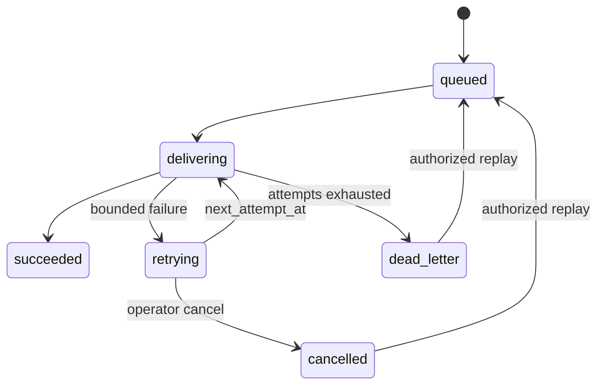

# Data Delivery

## Targets

Siftlane supports two target types:

| Type | Destination | Authentication | Result |
| --- | --- | --- | --- |
| `ndjson` | `<data-dir>/exports/<target-id>/<delivery-id>.ndjson` | None | Relative artifact path and SHA-256 |
| `webhook` | Reviewed HTTP or HTTPS URL | None, Bearer or HMAC-SHA256 | HTTP status and payload SHA-256 |

Webhook requests carry `Idempotency-Key` and `X-Siftlane-Delivery`. HMAC targets also carry `X-Siftlane-Signature: sha256=<hex>`. Redirects are not followed, private addresses are rejected unless the deployment explicitly enables private networks, and response bodies are not copied into errors.

## State Machine

The unique `(target_id, idempotency_key)` constraint returns the original delivery for repeated creation requests. A duplicate request does not call the target again. Retry delay is exponential and capped at five minutes; target `max_attempts` is capped at ten.

## Authorization And Audit

Targets have the same `private/team` visibility and owner model as flows. Editors can create targets and deliver runs they may execute. Only an owner or administrator can change a target, cancel a retry or replay a dead letter. Every create, update, cancellation and replay is appended to the audit log.

## Operations

1. Pause a failing target to stop new successful sends.
2. Inspect `status`, `attempt_count`, `error`, `next_attempt_at` and `response_status` in delivery history.
3. Correct the remote target or rotate its scoped secret.
4. Re-enable the target and replay individual dead letters.
5. Confirm a replay keeps the original delivery ID and idempotency key.

Never delete delivery history to hide a fault. A target with delivery history cannot be deleted.
